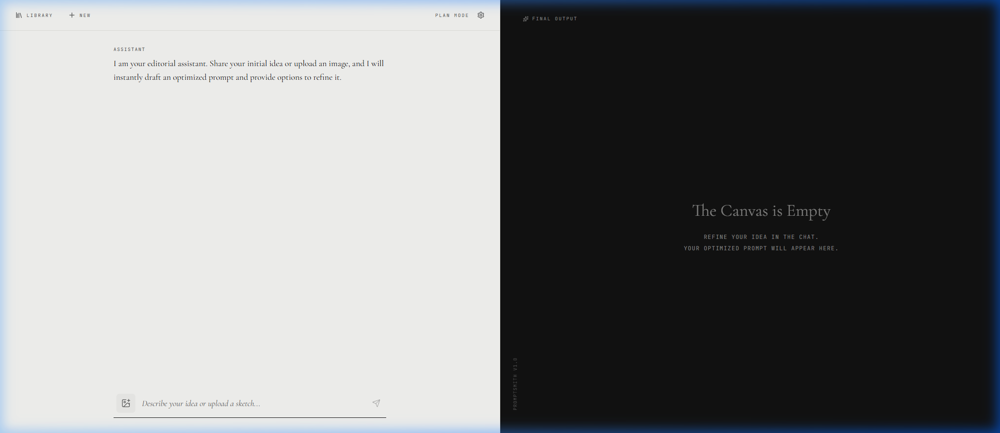

# Promptsmith



Promptsmith is an elegant, editorial-style interface designed for prompt engineering. It acts as an interactive bridge between your raw ideas and highly optimized AI prompts.

Instead of writing a prompt from scratch, you provide Promptsmith with a rough concept or an image. The application then enters a conversational "Plan Mode," asking clarifying multiple-choice and open-ended questions. Once it has enough context, it synthesizes your inputs and outputs a robust, production-ready prompt that you can copy or export.

## Architecture & Features

Promptsmith is built with a React 19 frontend and a Node.js/Express backend. 

* **Tri-Provider AI Integration:** Natively supports Google Gemini, OpenRouter, and local models via Ollama. It dynamically fetches available models and handles multimodal inputs (text + images).
* **Conversational Refinement:** The assistant doesn't just output a prompt; it interviews you to extract missing constraints, target audience, tone, and formatting requirements.
* **Intelligent Auto-Extraction:** Once the assistant finishes the interview, it automatically extracts the final prompt into a dedicated, clean viewing pane.
* **Local First:** All chat history, image uploads, and generated prompts are stored locally in a `history` directory. No data is sent to a central database.
* **Usage Limits & Master Code:** The backend includes a rate-limiter for public deployments, which can be entirely bypassed by providing a predefined Master Code in the UI.

## Getting Started

### Local Development

1. **Install Dependencies**
   ```bash
   npm install
   ```

2. **Environment Configuration**
   Create a `.env` file in the root directory:
   ```env
   # Required for OpenRouter integration
   OPENROUTER_API_KEY=sk-or-...
   DEFAULT_OPENROUTER_MODEL=google/gemini-2.0-flash-lite-preview-02-05:free
   
   # Optional: Bypass code for rate limits
   MASTER_CODE=your_secret_code
   ```

3. **Run the Application**
   Start both the Vite frontend and Express backend concurrently:
   ```bash
   npm run dev
   ```

### Local Models (Ollama)

If you intend to use local models, you must start your Ollama server with cross-origin requests enabled so the browser can connect to it:

**Mac/Linux:**
```bash
OLLAMA_ORIGINS="*" ollama serve
```

**Windows (Command Prompt):**
```cmd
set OLLAMA_ORIGINS="*" && ollama serve
```

### Docker Deployment

Promptsmith is fully containerized. The `Dockerfile` compiles the React frontend and serves it statically via the Express backend, ensuring zero CORS issues and a single-port deployment.

```bash
docker-compose up -d --build
```

If deploying via Portainer, simply point your stack to this repository and expose port `80`. Ensure you mount a volume for `/app/history` if you want chat sessions to persist across container restarts.
